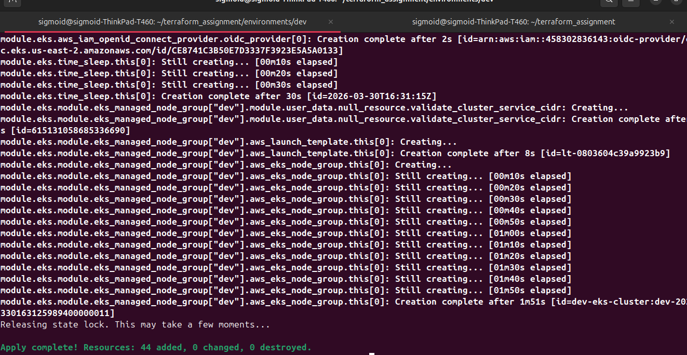
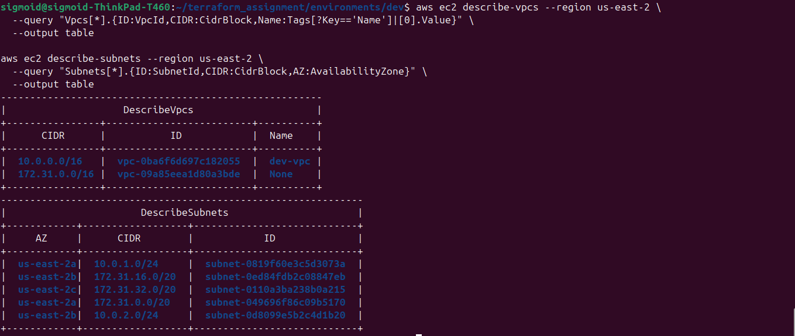
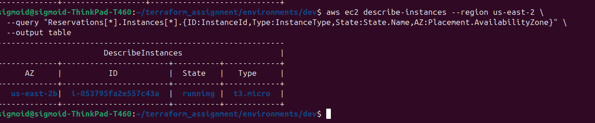
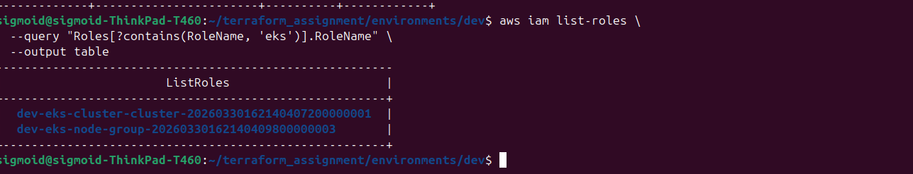
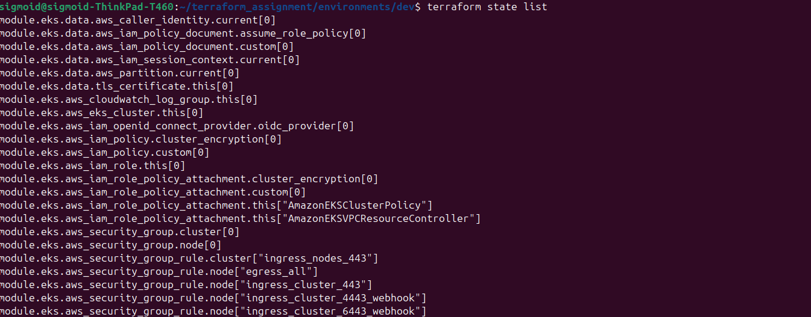
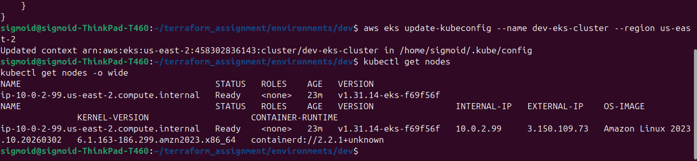
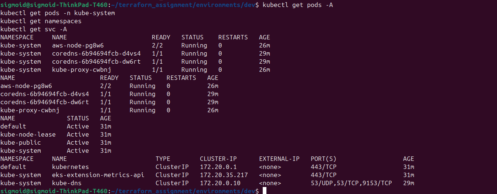
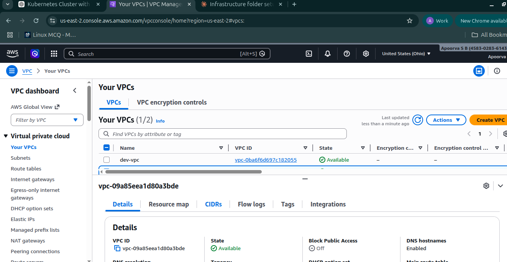
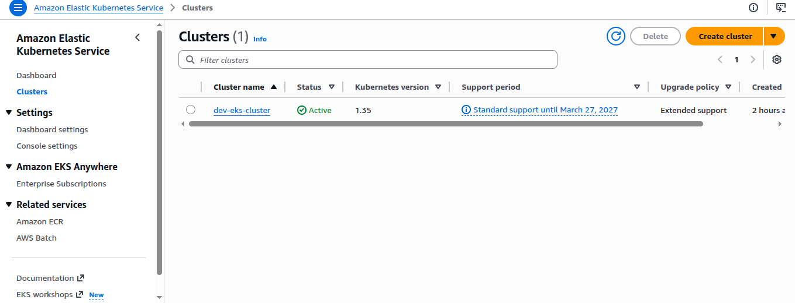

# Provisioning an EKS Cluster on AWS using Terraform

This is a hands-on project where I used Terraform to spin up an Amazon EKS cluster from scratch. The goal was to understand how to manage real cloud infrastructure as code — including remote state, networking, and Kubernetes worker nodes.

---

## What I built

- A custom VPC with two public subnets across different availability zones
- An EKS cluster running Kubernetes 1.31
- A managed node group with a single `t3.micro` worker node
- Remote state stored in S3 with DynamoDB locking so state doesn't get corrupted

I also did this for two environments — `dev` and `qa` — using the same module structure.

## The Terraform Files

**`provider.tf`** — sets up the AWS provider pointing to `us-east-2`

**`backend.tf`** — configures remote state in S3 with DynamoDB locking

```hcl
terraform {
  backend "s3" {
    bucket         = "terraform-state-apoorva613"
    key            = "dev/terraform.tfstate"
    region         = "us-east-2"
    dynamodb_table = "terraform-lock"
  }
}
```

**`main.tf`** — the main file that creates the VPC and EKS cluster using community modules

```hcl
module "vpc" {
  source  = "terraform-aws-modules/vpc/aws"
  version = "5.0"

  name = "dev-vpc"
  cidr = "10.0.0.0/16"
  azs  = ["us-east-2a", "us-east-2b"]

  public_subnets       = ["10.0.1.0/24", "10.0.2.0/24"]
  enable_nat_gateway   = false
  map_public_ip_on_launch = true
}

module "eks" {
  source  = "terraform-aws-modules/eks/aws"
  version = "20.33.1"

  cluster_name    = "dev-eks-cluster"
  cluster_version = "1.31"

  vpc_id     = module.vpc.vpc_id
  subnet_ids = module.vpc.public_subnets

  eks_managed_node_groups = {
    dev = {
      instance_types = ["t3.micro"]
      min_size       = 1
      max_size       = 1
      desired_size   = 1
    }
  }
}
```

---

## Steps I followed

### 1. Ran terraform apply

```bash
terraform init
terraform plan
terraform apply
```





---

### 2. Verified the VPC and subnets

```bash
aws ec2 describe-vpcs --region us-east-2 \
  --query "Vpcs[*].{ID:VpcId,CIDR:CidrBlock,Name:Tags[?Key=='Name']|[0].Value}" \
  --output table

aws ec2 describe-subnets --region us-east-2 \
  --query "Subnets[*].{ID:SubnetId,CIDR:CidrBlock,AZ:AvailabilityZone}" \
  --output table
```

This confirmed that `dev-vpc` was created with the right CIDR and both subnets showed up in the correct AZs.



Also verified the EC2 instance that serves as the worker node:

```bash
aws ec2 describe-instances --region us-east-2 \
  --query "Reservations[*].Instances[*].{ID:InstanceId,Type:InstanceType,State:State.Name,AZ:Placement.AvailabilityZone}" \
  --output table
```



And confirmed the IAM roles that were auto-created for the cluster and node group:

```bash
aws iam list-roles \
  --query "Roles[?contains(RoleName, 'eks')].RoleName" \
  --output table
```



---

### 3. Checked the Terraform state

```bash
terraform state list
```

This listed all 44 resources Terraform is tracking — everything from the EKS cluster and OIDC provider to security group rules and IAM policy attachments.



---

### 4. Connected kubectl to the cluster

```bash
aws eks update-kubeconfig --name dev-eks-cluster --region us-east-2
kubectl get nodes
kubectl get nodes -o wide
```

The node came up as `Ready` with Kubernetes version `v1.31.14-eks-f69f56f`, running Amazon Linux 2023 with containerd as the runtime.



Then verified all the system pods and services:

```bash
kubectl get pods -A
kubectl get namespaces
kubectl get svc -A
```

All the core system pods were running fine — `aws-node`, `coredns`, and `kube-proxy` were all healthy.



---

### 5. Verified in the AWS Console

Checked the VPC console to confirm `dev-vpc` was available:



Checked the EKS console — cluster status was Active with Kubernetes 1.31:




---

### 6. QA AND PROD environment

I repeated the same setup for a `qa` AND `Prod`  environment. 
---

